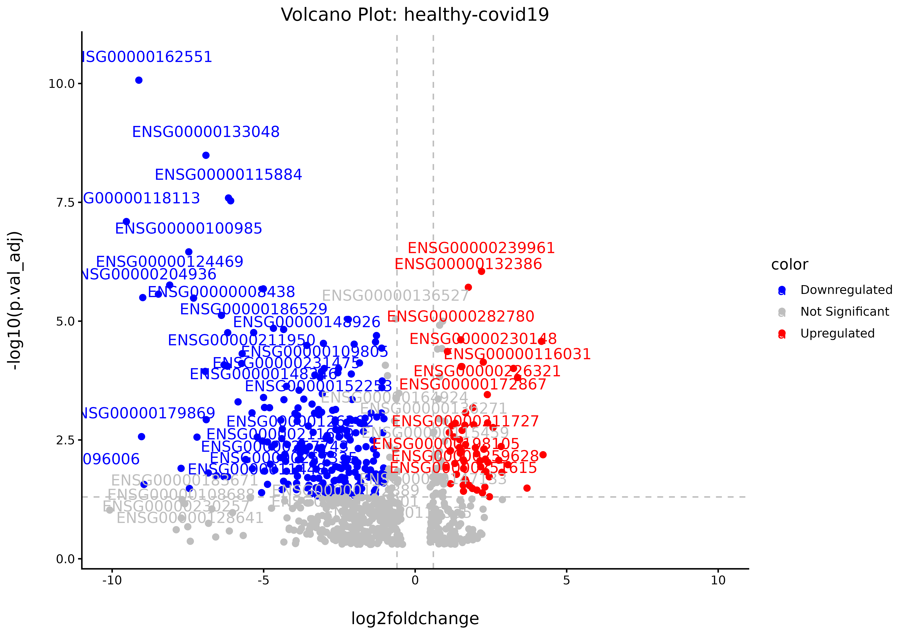
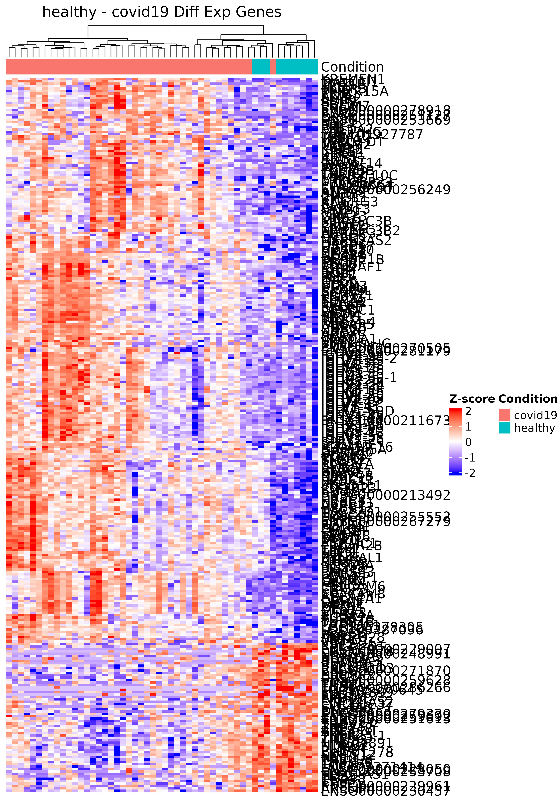
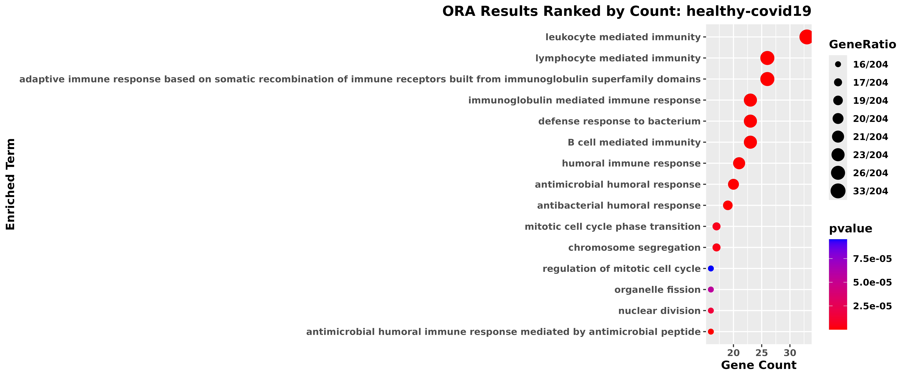
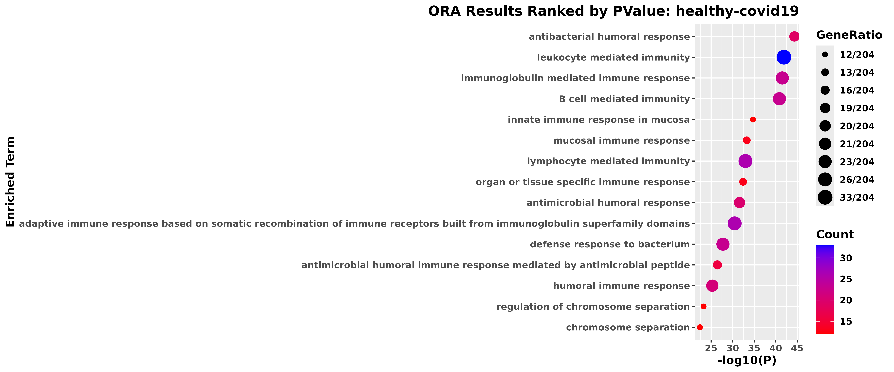

# bulkanalysis_demo

``` r

#devtools::install_github("https://github.com/rumchada/bulkanalysis_repo")
```

``` r

library(bulkanalysis)
```

## Introduction

The purpose of the bulkanalysis package is to streamline the downstream
analysis of bulk RNA-seq data by providing a collection of commonly used
analysis and visualizations in a single package. The package was
developed as a wrapper around statistical and visualization methods that
I have frequently encountered during my experience analyzing bulk
RNA-seq data. Rather than introducing new statistical methods,
bulkanalysis is designed to reduce repetitive coding and provide a
consistent workflow for obtaining commonly used downstream results. This
package performs techniques such as differential expression via
[edgeR](https://web.stanford.edu/class/bios221/labs/rnaseq/lab_4_rnaseq.html)
with traditional outputs such as heatmaps, volcano plots. As well as
over-representation analysis via
[clusterProfiler](https://yulab-smu.top/biomedical-knowledge-mining-book/enrichplot.html)
using [Fishcher’s Exact
Test](https://www.youtube.com/watch?v=udyAvvaMjfM) with summarized
output visuals (As of 9/17/26).

The raw results and output visuals are accessible by either executing
the individual functions or through the
`bulkanalysis::run_de_pipeline()}`’s nested list output.This vignette
below will go into detail on the inputs necessary for the
[`bulkanalysis::run_de_pipeline()`](https://rumchada.github.io/bulkanalysis_repo/reference/run_de_pipeline.md)
and the outputs of functions. The overall goal of this package is to
save time on initial biological inferences of bulk-RNAseq experiments by
cutting out repetitive coding, visualization building, and parsing
through large noise of large statistical results. Delivering summarized
results for faster interpretations of your data. By combining these
steps into reusable functions, the package provides summarized results
that can be used to more efficiently explore potential biological
patterns in the data. These results are intended to support initial
biological interpretation rather than replace more comprehensive
statistical or biological investigation.

Input Data First we need to format a random bulk-RNAseq dataset that has
been pre-processed (from FASTQ files), but unnormalized counts to enter
into a
[DESeqDataSet](https://www.rdocumentation.org/packages/RNAseqQC/versions/0.2.1/topics/make_dds)
via
[`RNAseqQC::make_dds()`](https://rdrr.io/pkg/RNAseqQC/man/make_dds.html).
This is because make_dds() does not accept continuous counts. Which
requires at minimum a count matrix in the `matrix` class from base-r and
meta-data table with following columns:

`sample_names`: The names of the samples of your bulk-RNAseq experiment
in the same exact arrangement and character format
(capitlaize/lower_case).

`sample_condition`: which tells the experimental condition of your
samples.

These inputs can then be provided to
[`bulkanalysis::edgeR_diffexp()`](https://rumchada.github.io/bulkanalysis_repo/reference/edgeR_diffexp.md)
to perform pairwise differential expression analysis between
experimental conditions. A reference condition is specified so that the
resulting comparisons are interpreted relative to a defined baseline. In
many experiments, this reference may be a condition such as control or
healthy, although the appropriate reference depends on the experimental
design.

## Bulk-RNASeq Formatting

This section will show you how to prepare a random dataset from [GEO
Query](https://www.ncbi.nlm.nih.gov/geo/query/acc.cgi?acc=GSE202805) for
the bulkanalysis package functions. GEO202805 will be used to prepare a
DESeqDataSet object compatible with the rest of functions in the bulk
analysis package.

**GEO202805 Summary**

RNA sequencing was performed on a total of 80 PBMC samples derived from
healthy controls (n = 10), acute-Mild (n = 4), Acute-Moderate (n = 6),
Acute-Severe (n = 32) and Convalescent = 28. For this

**Citation**: Minghan,.L , Yuqing,.S, Yizhou,.T, Yuefan,.L, Weidong,.T,
” Global Transcriptomic analysis of PBMC derived from COVID-19
acute-severe patients and convalescents”, (May, 2022),PRJNA837285; GEO:
GSE202805.

#### Downloading GEOquery Data

Check meta data for which groups you would like set the comparisons
to.For this demonstration we will be binning the all the acute covid-19
samples (mild, moderate, severe). In your metadata, you can partition
each of these labels in a more granular fashion.

``` r

#checking if path exists
path <- "./GSE202805/GSE202805_genecounts_20220406.txt.gz"

counts <- utils::read.delim(gzfile(path))

colnames(counts) <- base::sub("\\.bam$", "", colnames(counts))
#Some dataset will still come with the sorted bam file that outputs from command line functions such as featureCounts (subread)
#The columns being deleted are not necessary unless we are integrating ChIP or ATAC data.
counts <- counts %>% dplyr::select(-c(Chr, Start, End, Strand, Length))
# contains the count vectors of the 8 samples
#Some dataset will still come with the sorted bam file that outputs from command line functions such as featureCounts (subread)
#counts[1:10, 1:10]
knitr::kable(counts[1:10, 1:10])
```

| Geneid            | R11255 | R11257 | R11259 | R11260 | R11263 | R11265 | R11266 | R11268 | R11273 |
|:------------------|-------:|-------:|-------:|-------:|-------:|-------:|-------:|-------:|-------:|
| ENSG00000223972.5 |     46 |     69 |     20 |     42 |    182 |     13 |     10 |     47 |      5 |
| ENSG00000227232.5 |     62 |     77 |     93 |     68 |     98 |    101 |    141 |     84 |     99 |
| ENSG00000278267.1 |      1 |      5 |      0 |      0 |     11 |      2 |      5 |      1 |      3 |
| ENSG00000243485.5 |      0 |      0 |      0 |      0 |      0 |      0 |      0 |      6 |      0 |
| ENSG00000284332.1 |      0 |      0 |      0 |      0 |      0 |      0 |      0 |      0 |      0 |
| ENSG00000237613.2 |      0 |      0 |      0 |      0 |      0 |      0 |      0 |      0 |      0 |
| ENSG00000268020.3 |      0 |      0 |      0 |      0 |      0 |      0 |      0 |      0 |      0 |
| ENSG00000240361.2 |      0 |      0 |      0 |      0 |      0 |      0 |      0 |      0 |      0 |
| ENSG00000186092.6 |      0 |      0 |      0 |      0 |      0 |      0 |      2 |      0 |      0 |
| ENSG00000238009.6 |      1 |      0 |      1 |      6 |      1 |      0 |      5 |     12 |      0 |

Some datasets will still come within the sorted bam file that outputs
from command line functions such as featureCounts (subread). In case
that happens use the select(-c()) to get rid of columns such as Chr,
Start, End, Strand, Length. Which useful if you have genomic (ChIP)or
epigenomic (ATAC). However we will have to use tidyverse on the metadata
table to only the basic relevant columns.

## Meta-Data Editing

``` r

# summarizing replicated genes across all samples
counts <- counts %>%
  group_by(geneid) %>%
  summarise(across(where(is.numeric), sum))

counts <- counts %>% column_to_rownames(var = "geneid")

metadata[] <- lapply(metadata, factor)
```

``` r

knitr::kable(metadata[1:10, 1:ncol(metadata)])
```

| sample         | condition |
|:---------------|:----------|
| R11257_covid19 | covid19   |
| R11259_covid19 | covid19   |
| R11260_covid19 | covid19   |
| R11263_covid19 | covid19   |
| R11265_covid19 | covid19   |
| R11266_covid19 | covid19   |
| R11268_covid19 | covid19   |
| R11273_covid19 | covid19   |
| R11276_covid19 | covid19   |
| R11279_covid19 | covid19   |

## Making DDS Object

make_dds(): Make DESeqDataSet from counts matrix and metadata.

Per transcript counts of RNA-seq exhibit a mean-variance relationship
([hetroscedastic](https://www.biostars.org/p/9587730/)). However many
tests within RNA-seq pipeline require non-hetroscedastic data.
Normalizations are require to smooth the variation of the data.
[Normalization](https://hbctraining.github.io/DGE_workshop/lessons/02_DGE_count_normalization.html)
scales the raw count of values to account for the technical batch
effects between samples. This way expression level are comparable
between and within samples.

**`vst()` (wrapper for
[`DESeq2::varianceStabilizingTransformation()`](https://rdrr.io/pkg/DESeq2/man/varianceStabilizingTransformation.html))**:
variance stabilizing transformation transforms normalizes count data to
reduce the dependence between the mean and variance. This produces an
approximately homoscedastic representation of the data, making it more
appropriate for exploratory analyses based on distances or correlations,
such as PCA and clustering. The transformed values are intended for
exploratory analysis and visualization rather than
differential-expression testing.The result is applied to the
[`bulkanalysis::baseline_dimreduction()`](https://rumchada.github.io/bulkanalysis_repo/reference/baseline_dimreduction.md)
function.

**Log normalization**: The typical distribution of bulk-RNAseq data
follows a Poisson (Var = mean) or a Negative Binomial Distribution (Var
\> Mean) For data containing a large amount of zeros, the log
transformation serves to minimize the frequency of zeroes relative to
transcripts with counts \>= 1. This will help to visualize the data
though a normal distribution. This is typcial are typical for scRNA-Seq
and ST data. To avoid taking the log of 0, it is common to add a +1
pseudo value.

More information on
[Normalization](https://www.youtube.com/watch?v=u3395drEfrs&list=PLg0JKLUfmkdkIr-9hvFLY1O1JRqOdjTSW)

**Note**: These transformations are not used within the differential
expression analysis. This is because packages such as EdgeR and DESeq2
are built to take into account for the typical Poisson or Negative
Binomial distribution.

``` r

# saveRDS does not work in the vignette build
#saveRDS(covid19_ds1,"./vignette_data/gse202805_test_data.rds")
```

## Bulk Analysis Demonstration

standardization of meta-data labels.

``` r

# In some scenarios, you will need to standardize your condition
covid19_ds1@colData$condition <- covid19_ds1@colData$condition %>% tolower()
```

#### EdgeR Based Differential Expression

Performs EdgeR based differential expression with limma support of each
covariate specified in your meta-data with user set reference variable
for pairwise differential expression of each sample condition within the
submitted meta-data of your formatted Deseqdataset object. This is a
standard pipeline sourced from [Daniel Neves and Daniel Sobral, “Using
DESeq2 and edgeR in R”, (April, 2018)
vignette](https://gtpb.github.io/ADER18F/pages/tutorial1.html)

1\. Extracts Raw counts

2.  filters for low count genes within your count matrix and keeps
    sufficiently large counts to be retained in a statistical analysis
    (`edgeR::filterByExpr(y)`). Filtering is performed with respect to
    the experimental design/replication structure, rather than using an
    arbitrary fixed count cutoff.

3.  `edgeR::normLibSizes(y)` calculates normalization factors, commonly
    using **TMM.**([TMM
    normalization](https://davetang.github.io/muse/edger.html) via
    `edgeR::normLibSizes(y)`). These factors adjust the effective
    library sizes so that samples are comparable despite differences in
    sequencing depth and RNA composition.

4.  Re-affirms reference level relative to the experimental covariate

5.  set design matrices as mean reference model expression =
    B1(reference)m + B2(experiemnt) for each pairwise combination of
    conditions in the metadata.

    `design <- model.matrix(~0+condition, data = y$samples).`the model
    estimates the mean expression associated with each condition, and
    contrasts between those coefficients define the desired comparisons.
    THIS IS NOT THE PRIMARY COMPARISON ONLY FOR DESIGN MATRIX
    CONTRSUCTION.

6.5: Estimates variability of each gne in the count data

6.  Set limma::makeContrats() for each comparison of contrasts vectors
    to be applied in the
    [`edgerR::glmQLFit()`](https://www.rdocumentation.org/packages/edgeR/versions/3.14.0/topics/glmQLFit)
    function.

For each contrast (comparison (reference vs x) and vector)

7\. edgerR::glmQLFit() which fits the negative binomial generalised
linear model using quaisi-liklihood methods and determines whether the
observes group difference are larger than expected variability.

8.Applies either Family Wise Error(‘bonferonni’) or False Discovery
Rate(‘BH’) pvalue correction

9.  Applies user filter of initial p.adjust value. Default is no filter
    applied.

**Output**: A list object of data frames containing each possible
combination of binary \#’ comparisons (control vs. experimental group)
within the supplied metadat

``` r

dds_object <- covid19_ds1
#Add the condition column name
condition_col = "condition"
#set a refreence group name
ref_group_name = "healthy"


#Performs inital differential expression on your DDS Object's raw counts dataframe
# The use give the condition column from the metadata to make the test parameters
# and the control group
results_dds1 <- edgeR_diffexp(covid19_ds1, 
                              condition_col,  
                              ref_group_name,
                              init_pval_cutoff = 0.5,
                              adjust.method = "bonferroni")
```

Result is a list of tables with details on the differences of gene
expression between genes through each of samples in the count matrix.

``` r

healthy_covid19_results <- results_dds1$`healthy-covid19`
```

``` r

healthy_covid19_results <- results_dds1$`healthy-covid19`

knitr::kable(results_dds1$`healthy-convalescent`[1:10, 1:ncol(healthy_covid19_results)])
```

| geneid          | log2foldchange |     logCPM |         F | PValue | p.val_adj |
|:----------------|---------------:|-----------:|----------:|-------:|----------:|
| ENSG00000272173 |      -3.758680 |  0.1629976 | 147.29132 |      0 |         0 |
| ENSG00000200156 |      -4.682367 | -0.0290629 | 112.20243 |      0 |         0 |
| ENSG00000287190 |      -4.380503 |  1.0329132 | 114.76031 |      0 |         0 |
| ENSG00000207205 |      -4.077849 | -0.0275487 |  91.80691 |      0 |         0 |
| ENSG00000111678 |      -3.617110 |  3.3322679 | 118.53750 |      0 |         0 |
| ENSG00000212195 |      -3.830325 |  1.0317549 |  81.25352 |      0 |         0 |
| ENSG00000270022 |      -3.805682 |  2.3153486 |  90.55365 |      0 |         0 |
| ENSG00000200169 |      -3.517921 |  0.2384656 |  76.09676 |      0 |         0 |
| ENSG00000276216 |      -3.496121 |  0.6214368 |  73.98809 |      0 |         0 |
| ENSG00000221539 |      -2.292173 |  1.7619859 |  71.95162 |      0 |         0 |

## **Running the whole DE Downstream pipeline**

Inputs: the DDS object, Results of the EdgeR Differential Expression
analysis

**Arguments:**

- `dds_object`:A formatted DESeq2 object where each sample and its
  counts are aligned with the respective metadata in `@colData`.

- `edgeR_results`: A dataframe of differential expression results
  (minimum columns: log2fc, pvalue, p.adjust) **DEG statisitcal inputs**

- `deg_log2fc_thresh`: absolute value cutoff of log2fc

- `deg_pval_adj_thresh`: pvalue cutoff for initial log2fc values

**Volcano Plots Arguments**

- `vol_plot_lower_xlim`: Numeric value specifying the lower limit of the
  x-axis. Should be less than 0. For example, `-5`.

- `vol_plot_upper_xlim`: Numeric value specifying the upper limit of the
  x-axis. Should be greater than 0. For example, `5`.

- `cartesian_step`: Numeric value specifying the interval between x-axis
  ticks.

**ORA Arguments**

- `ora_pval_adj_threshold`: pvalue cutoff of the over-representation
  test

- `ora_convert_ids`: Boolean option to convert the gene IDs from
  Ensemble to External format

- `orgdb`: An organism-specific annotation database used to facilitate
  gene identifier conversion, such as org.Hs.eg.db for human or
  org.Mm.eg.db for Mus Musculous.

- `ensembl_dataset`: Character string specifying the Ensembl dataset
  used for annotation. For example, `"hsapiens_gene_ensembl"` for human
  genes.

``` r

library(org.Hs.eg.db)
#> 
covid19_ds1_analysis <- run_de_pipeline(
                                covid19_ds1, 
                                results_dds1,
                                deg_log2fc_thresh = 1, 
                                deg_pval_adj_thresh = 0.05, 
                                vol_plot_lower_xlim = -10, 
                                vol_plot_upper_xlim = 10, 
                                cartesian_step = 5,
                                #WARNING: KEEP THIS BOOLEAN FALSE
                                #TAKES REALLY SLOW TO CONVERT ORA IDS ON MAC
                                ora_convert_ids = FALSE,
                                ora_pval_adj_threshold = 0.10,
                                orgdb = org.Hs.eg.db,
                                ensembl_dataset = "hsapiens_gene_ensembl"
                              )
#> 
#> 
#> Processing: healthy vs convalescent
#> [1] 114
#> Comparison:healthy vs convalescent has 114 DEGs
#> Comparison:healthy vs convalescent has 114 DEGs
#> biomaRt attempt 1 of 2...
#>   -> biomaRt attempt 1 failed: HTTP 405 Method Not Allowed.
#> biomaRt attempt 2 of 2...
#>   -> biomaRt attempt 2 failed: HTTP 405 Method Not Allowed.
#> 'select()' returned 1:many mapping between keys and columns
#> Comparison:healthy vs convalescent has 114 UNIQUE DEGs
#> Processing: healthy vs covid19
#> [1] 297
#> Comparison:healthy vs covid19 has 297 DEGs
#> Comparison:healthy vs covid19 has 297 DEGs
#> biomaRt attempt 1 of 2...
#>   -> biomaRt attempt 1 failed: HTTP 405 Method Not Allowed.
#> biomaRt attempt 2 of 2...
#>   -> biomaRt attempt 2 failed: HTTP 405 Method Not Allowed.
#> 'select()' returned 1:many mapping between keys and columns
#> Comparison:healthy vs covid19 has 297 UNIQUE DEGs
#> Processing: convalescent vs covid19
#> [1] 1409
#> Comparison:convalescent vs covid19 has 1409 DEGs
#> Comparison:convalescent vs covid19 has 1409 DEGs
#> biomaRt attempt 1 of 2...
#>   -> biomaRt attempt 1 failed: biomaRt error: looks like we're connecting to incompatible version of BioMart.
#> biomaRt attempt 2 of 2...
#>   -> biomaRt attempt 2 failed: Your query has been redirected to https://status.ensembl.org indicating this Ensembl service is currently unavailable.
#> Look at ?useEnsembl for details on how to try a mirror site.
#> 'select()' returned 1:many mapping between keys and columns
#> Comparison:convalescent vs covid19 has 1407 UNIQUE DEGs
#> 
#> 'select()' returned 1:many mapping between keys and columns
#> Warning in bitr(gene, fromType = fromType, toType = "ENTREZID", OrgDb = OrgDb):
#> 5.26% of input gene IDs are fail to map...
#> 'select()' returned 1:many mapping between keys and columns
#> Warning in bitr(gene, fromType = fromType, toType = "ENTREZID", OrgDb = OrgDb):
#> 19.35% of input gene IDs are fail to map...
#> 'select()' returned 1:many mapping between keys and columns
#> Warning in bitr(gene, fromType = fromType, toType = "ENTREZID", OrgDb = OrgDb):
#> 46.36% of input gene IDs are fail to map...
#> Warning: Using size for a discrete variable is not advised.
#> Using size for a discrete variable is not advised.
#> 'select()' returned 1:many mapping between keys and columns
#> Warning in bitr(gene, fromType = fromType, toType = "ENTREZID", OrgDb = OrgDb):
#> 33.68% of input gene IDs are fail to map...
#> 'select()' returned 1:many mapping between keys and columns
#> Warning in bitr(gene, fromType = fromType, toType = "ENTREZID", OrgDb = OrgDb):
#> 4.26% of input gene IDs are fail to map...
#> 'select()' returned 1:many mapping between keys and columns
#> Warning in bitr(gene, fromType = fromType, toType = "ENTREZID", OrgDb = OrgDb):
#> 8.92% of input gene IDs are fail to map...
#> Warning in bitr(gene, fromType = fromType, toType = "ENTREZID", OrgDb = OrgDb):
#> Using size for a discrete variable is not advised.
#> Warning in bitr(gene, fromType = fromType, toType = "ENTREZID", OrgDb = OrgDb):
#> Using size for a discrete variable is not advised.
#> Warning in bitr(gene, fromType = fromType, toType = "ENTREZID", OrgDb = OrgDb):
#> Using size for a discrete variable is not advised.
#> Warning in bitr(gene, fromType = fromType, toType = "ENTREZID", OrgDb = OrgDb):
#> Using size for a discrete variable is not advised.
#> Warning in bitr(gene, fromType = fromType, toType = "ENTREZID", OrgDb = OrgDb):
#> Using size for a discrete variable is not advised.
#> Warning in bitr(gene, fromType = fromType, toType = "ENTREZID", OrgDb = OrgDb):
#> Using size for a discrete variable is not advised.
```

### Outputs

The outputs of the run_de_pipeline are described below

`filtered_results`: The initial filtered result of DEGs log2fc and
pval_adj_threshold.

**Columns:**

- \`log2FC\`: The log2-scaled fold change of a given gene across the \#’
  specified samples.

- `P-value`: The probability of obtaining data as extreme as the \#’
  observed values assuming that the null hypothesis is true.

- `Q-value (FDR or FWER)`: The proportion of false positives after
  accounting \#’ for multiple testing.

``` r

library(glue)
#> 
#> Attaching package: 'glue'
#> The following object is masked from 'package:SummarizedExperiment':
#> 
#>     trim
#> The following object is masked from 'package:GenomicRanges':
#> 
#>     trim
#> The following object is masked from 'package:IRanges':
#> 
#>     trim
demo_results <-covid19_ds1_analysis$filtered_results$`healthy-covid19`

knitr::kable(glue("Total DEGs in healthy vs covid-19 comparison: {dim(demo_results)[1]}"))
```

| x                                                 |
|:--------------------------------------------------|
| Total DEGs in healthy vs covid-19 comparison: 297 |

``` r


knitr::kable(demo_results[1:10, 1:ncol(demo_results)])
```

| geneid | log2foldchange | logCPM | F | PValue | p.val_adj | color |
|:---|---:|---:|---:|---:|---:|:---|
| ENSG00000162551 | -9.118798 | 6.856737 | 78.45615 | 0 | 0.0e+00 | Downregulated |
| ENSG00000133048 | -6.905306 | 5.218843 | 68.07271 | 0 | 0.0e+00 | Downregulated |
| ENSG00000115884 | -6.160175 | 2.477781 | 60.79484 | 0 | 0.0e+00 | Downregulated |
| ENSG00000164047 | -6.088636 | 3.020350 | 60.42745 | 0 | 0.0e+00 | Downregulated |
| ENSG00000118113 | -9.529849 | 5.969254 | 61.74041 | 0 | 1.0e-07 | Downregulated |
| ENSG00000100985 | -7.470679 | 4.830199 | 56.52675 | 0 | 3.0e-07 | Downregulated |
| ENSG00000239961 | 2.190019 | 3.949011 | 57.74562 | 0 | 9.0e-07 | Upregulated |
| ENSG00000124469 | -8.100826 | 5.663755 | 52.63149 | 0 | 1.7e-06 | Downregulated |
| ENSG00000132386 | 1.754871 | 3.729244 | 55.18782 | 0 | 1.9e-06 | Upregulated |
| ENSG00000229314 | -5.010021 | 1.539478 | 48.83306 | 0 | 2.1e-06 | Downregulated |

**run_de_pipeline outputs**

`volcano_plots`: visualization of the filtered results on a volcano plot

`heatmap`:

`ora_up_raw`: Result of the over-representation analysis on upregulated
DEGs via clusterProfiler `unpacked_results_up`: unpacked results table
consisting of a nested list of ORA results on the upregulated DEGs

`ora_down_raw`: Result of the over-represenation analysis on
downregulated DEGs via clusterProfiler `unpacked_results_down`: unpacked
results table consisting of a nested list of ORA results on the
down-regulated DEGs

### Volcano Plot

ScatterPlot that shows the each DEGs importance on a volcano plot
(log2FC vs -log10(p.val_adj)) within 1 Comparison.

``` r

covid19_ds1_analysis$volcano_plots$`healthy-covid19`
```



#### Heatmaps

Uses ComplexHeatMap to compare z-scaled expression of DEGs from the
filtered results table. By adjusting the dimensions of the R image
window, the heatmap can edited so that he words can be either spaced out
and edited on photoshop later.

``` r

covid19_ds1_analysis$heatmap$`healthy-covid19`
```



#### ORA DotPlot Summary for Up Regulated and DownRegulated DEGs

Summarizes the the statistical significance and the count of each DEG in
an over-represented term.

``` r

covid19_ds1_analysis$ora_down_raw$enrichgo_visuals$`healthy-covid19`
#> $ora_count_ranked
#> $ora_count_ranked[[1]]
#> Warning: Using size for a discrete variable is not advised.
```



    #> 
    #> $ora_count_ranked[[2]]
    #> ORA Results Ranked by Count: healthy-covid19.png
    #> 
    #> 
    #> $ora_pvalue_ranked
    #> $ora_pvalue_ranked[[1]]
    #> Warning: Using size for a discrete variable is not advised.



    #> 
    #> $ora_pvalue_ranked[[2]]
    #> ORA Results Ranked by PValue: healthy-covid19.png

#### Unpacked Over-represented Terms

``` r

library(org.Hs.eg.db)
ora_results <- covid19_ds1_analysis$unpacked_results_down$`healthy-covid19`

example <- ora_results$`B cell mediated immunity`[1:10, ] %>% dplyr::select(-c(gene_desc.y,logCPM, "F"))


conversion_table <- gene_id_converter_ver2(example$geneid,
                       from_type = 'ensembl',
                       to_type = 'symbol',
                       org_db = org.Hs.eg.db,
                       ensembl_dataset = "hsapiens_gene_ensembl"
)
#> biomaRt attempt 1 of 2...
#>   -> biomaRt attempt 1 failed: Failed to perform HTTP request.
#> biomaRt attempt 2 of 2...
#>   -> biomaRt attempt 2 failed: Your query has been redirected to https://status.ensembl.org indicating this Ensembl service is currently unavailable.
#> Look at ?useEnsembl for details on how to try a mirror site.
#> 'select()' returned 1:many mapping between keys and columns
colnames(conversion_table)[1] <- "geneid"

knitr::kable(example)
```

| gene_desc.x | geneid | log2foldchange | PValue | p.val_adj | color |
|:---|:---|---:|---:|---:|:---|
| B cell mediated immunity | ENSG00000232216 | -3.787972 | 3.0e-07 | 0.0059319 | Downregulated |
| B cell mediated immunity | ENSG00000211968 | -4.382856 | 1.0e-07 | 0.0018654 | Downregulated |
| B cell mediated immunity | ENSG00000280411 | -3.881083 | 2.0e-07 | 0.0047027 | Downregulated |
| B cell mediated immunity | ENSG00000274576 | -4.874189 | 2.0e-07 | 0.0034783 | Downregulated |
| B cell mediated immunity | ENSG00000270550 | -3.832882 | 0.0e+00 | 0.0002844 | Downregulated |
| B cell mediated immunity | ENSG00000211972 | -2.945148 | 1.0e-07 | 0.0028573 | Downregulated |
| B cell mediated immunity | ENSG00000211950 | -5.726270 | 0.0e+00 | 0.0000778 | Downregulated |
| B cell mediated immunity | ENSG00000211937 | -3.489354 | 2.0e-07 | 0.0043644 | Downregulated |
| B cell mediated immunity | ENSG00000211955 | -3.102032 | 1.5e-06 | 0.0338385 | Downregulated |
| B cell mediated immunity | ENSG00000162747 | -6.308525 | 0.0e+00 | 0.0000831 | Downregulated |

``` r

knitr::kable(conversion_table)
```

| geneid          | external_gene_name |
|:----------------|:-------------------|
| ENSG00000232216 | IGHV3-43           |
| ENSG00000211968 | IGHV1-58           |
| ENSG00000280411 | IGHV1-69D          |
| ENSG00000274576 | IGHV2-70           |
| ENSG00000270550 | IGHV3-30           |
| ENSG00000211972 | IGHV3-66           |
| ENSG00000211950 | IGHV1-24           |
| ENSG00000211937 | IGHV2-5            |
| ENSG00000211955 | IGHV3-33           |
| ENSG00000162747 | FCGR3B             |

``` r

#We could also loop an individual function such as gene_id_converter_ver2
#to fix the unconvertered DEGs within the ORA analysis
```

``` r

example_conversion <- dplyr::left_join(example, conversion_table, by = "geneid")

example_conversion <- example_conversion %>% dplyr::select(-c(geneid)) %>% relocate(external_gene_name, .after = gene_desc.x)

knitr::kable(example_conversion)
```

| gene_desc.x | external_gene_name | log2foldchange | PValue | p.val_adj | color |
|:---|:---|---:|---:|---:|:---|
| B cell mediated immunity | IGHV3-43 | -3.787972 | 3.0e-07 | 0.0059319 | Downregulated |
| B cell mediated immunity | IGHV1-58 | -4.382856 | 1.0e-07 | 0.0018654 | Downregulated |
| B cell mediated immunity | IGHV1-69D | -3.881083 | 2.0e-07 | 0.0047027 | Downregulated |
| B cell mediated immunity | IGHV2-70 | -4.874189 | 2.0e-07 | 0.0034783 | Downregulated |
| B cell mediated immunity | IGHV3-30 | -3.832882 | 0.0e+00 | 0.0002844 | Downregulated |
| B cell mediated immunity | IGHV3-66 | -2.945148 | 1.0e-07 | 0.0028573 | Downregulated |
| B cell mediated immunity | IGHV1-24 | -5.726270 | 0.0e+00 | 0.0000778 | Downregulated |
| B cell mediated immunity | IGHV2-5 | -3.489354 | 2.0e-07 | 0.0043644 | Downregulated |
| B cell mediated immunity | IGHV3-33 | -3.102032 | 1.5e-06 | 0.0338385 | Downregulated |
| B cell mediated immunity | FCGR3B | -6.308525 | 0.0e+00 | 0.0000831 | Downregulated |

We can now annotate our heatmap with downregulated DEGs’s with the
over-represented terms. However keep in mind that these Geneid will be
over-represented by other terms. A good was to find that overlap is
using a network graph of the enriched terms and determining the
centrality of that network and which node (term) has the most edges
(DEGs).

## Future Work

Implement GSEA

Protein-Protein Interaction Network

New ORA visuals:

- Radial Upset Plot,

- ORA network visual for centrality,

- Make Unpacking Optional

## Citations

1.  Mark D. Robinson, Davis J. McCarthy, Gordon K. Smyth, edgeR: a
    Bioconductor package for differential expression analysis of digital
    gene expression data, *Bioinformatics*, Volume 26, Issue 1, January
    2010, Pages 139–140, <https://doi.org/10.1093/bioinformatics/btp616>
2.  Wu T, Hu E, Xu S, Chen M, Guo P, Dai Z, Feng T, Zhou L, Tang W, Zhan
    L, Fu x, Liu S, Bo X, Yu G (2021). “clusterProfiler 4.0: A universal
    enrichment tool for interpreting omics data.” *The Innovation*,
    **2**(3),
    100141.[doi:10.1016/j.xinn.2021.100141](https://doi.org/10.1016/j.xinn.2021.100141).
3.  Love MI, Huber W, Anders S (2014).“Moderated estimation of fold
    change and dispersion for RNA-seq data with DESeq2.”*Genome
    Biology*, **15**,
    550.[doi:10.1186/s13059-014-0550-8](https://doi.org/10.1186/s13059-014-0550-8).
4.  Minghan,.L , Yuqing,.S, Yizhou,.T, Yuefan,.L, Weidong,.T, ” Global
    Transcriptomic analysis of PBMC derived from COVID-19 acute-severe
    patients and convalescents”, (May, 2022),PRJNA837285; GEO:
    GSE202805.

#### Contact

gbolden101@gmail.com
